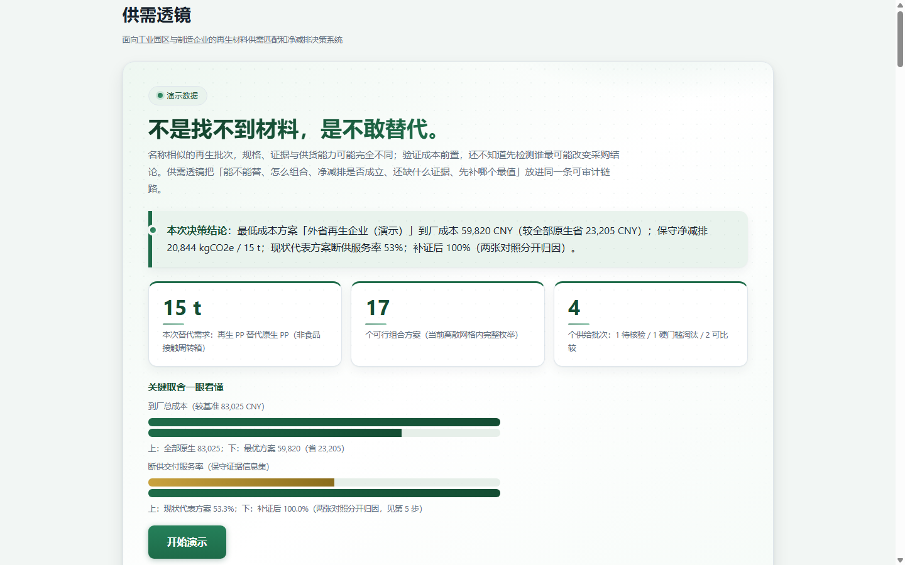
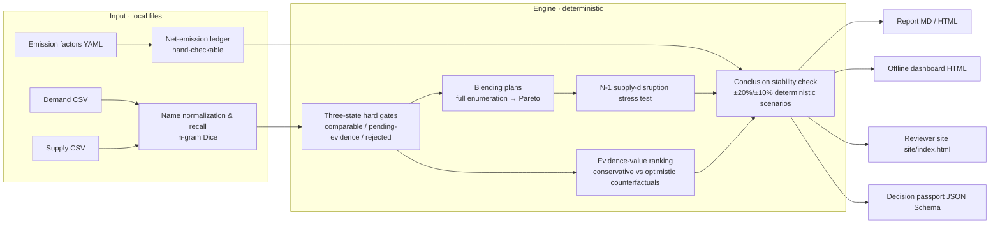

# SupplyLens (供需透镜)

[](https://github.com/Aisiweiyang/gongxu-lens-open/actions/workflows/ci.yml) [](#verification--quality) [](#status--scope) [MIT](LICENSE)



**Supply-demand matching and net-emission-avoidance decision system for industrial
parks and manufacturers.**

[简体中文（源文档）](README.md) | English

> **Language policy**: Chinese is the authoritative documentation source (design,
> audit, operations and commercial materials are maintained in Chinese). This
> English README mirrors the project overview and quick start; where the two
> differ, the Chinese documents prevail. Audit records and measurement reports
> are kept in their original language and are reproducible from the repository.

`Python 3.12+ · PyYAML + OR-Tools · Offline computation · Deterministic algorithms · MIT`

SupplyLens connects scattered reusable surplus materials and recycled-material
supply batches inside and around an industrial park with substitution demands
from manufacturers. Under hard constraints on specification, quantity, time
window, price and transport, it produces actionable matching and blending
plans, and computes recycled content flows, net emission avoidance and green
costs — every number decomposable by hand. The core business question: can
material that would otherwise sit idle, be downcycled or be hauled away
substitute virgin material on-site, with proof of net environmental benefit
and economic viability?

## 30-second summary

- **Customer**: park administrators, park operating companies, circular-economy
  service providers. **Users**: waste-producing/supplying enterprises, buyers
  and process engineers, park sustainability staff.
- **First scenario**: recycled-PP pellets substituting virgin PP in
  non-food-contact industrial packaging/crates.
- **Input**: one material demand + several supply batches (spec/composition/
  quantity/time window/location/price/evidence), imported via local CSV
  (templates in `templates/`).
- **Output**: Markdown/HTML report + self-contained offline dashboard —
  three-state substitution screening, blending frontier, hand-checkable net
  emission avoidance, green cost and marginal abatement cost, and a one-page
  decision passport.
- **Boundary**: describes only the matching result and scenario accounting for
  the imported demand/supply. It is not a market-wide, trading or compliance
  conclusion; demo data must not be used for real decisions.

## Architecture



Nothing leaves the machine: all inputs are local CSV/YAML; all computation is
deterministic (same input → byte-identical output, locked by tests).

## Quick start

### Offline demo (report + dashboard + reviewer site)

Install Python 3.12+ and clone the repository. On Windows PowerShell:

```powershell
git clone https://github.com/Aisiweiyang/gongxu-lens-open.git
cd gongxu-lens-open
py -3 -m venv .venv
.\.venv\Scripts\python.exe -m pip install -r requirements.txt
.\.venv\Scripts\python.exe run.py --industry 再生PP --data-mode demo
.\.venv\Scripts\python.exe serve.py --port 8765
```

On Linux/macOS, create the environment with `python3 -m venv .venv` and use
`.venv/bin/python` for installation and both commands. Open
<http://127.0.0.1:8765/>. Commands below use the virtual environment's Python.

`requirements.txt` pins PyYAML and OR-Tools. Installing only PyYAML supports
small cases; oversized cases fall back to a greedy feasible plan explicitly
labelled as having unproven optimality. Results from these configurations differ.

```bash
python run.py --industry 再生PP --data-mode demo    # writes report + dashboard to output/, site to site/
python serve.py --port 8765                          # local preview at http://127.0.0.1:8765/
```

### Pilot workbench (multi-user, database-backed)

```bash
python pilot/start_pilot.py --port 8765              # first visit initializes the admin account
python scripts/pilot_selfcheck.py --port 8765        # deployment self-check (read-only)
```

Roles: admin / editor / viewer. The workbench covers demand → supply batches →
evidence tasks → plan comparison → confirmed reservation → delivery feedback →
decision passport, plus a **multi-demand matching** view (read-only suggestion,
never a reservation) with an exportable, print-friendly matching sheet.

For Linux deployment (recommended: measured engine performance is 2–3×
Windows), including systemd and backup strategy, see
`docs/试点部署指南-Linux-v20.md` (Chinese; standard Ubuntu/Debian steps).

## How it works

1. **Three-state hard gates** — polymer type, form, color, MFI, moisture, ash,
   recycled content, quantity, time window and distance are evaluated
   individually as pass / fail / unknown. Any fail → rejected; any unknown
   (including numbers without a test report) → pending evidence; all pass →
   comparable. Missing evidence is not non-compliance.
2. **Net emission avoidance** (functional unit: 1 t of qualified pellets
   delivered to spec):

   ```text
   E_baseline  = Q × virgin-PP production factor + Q × baseline distance × baseline transport factor
   E_project   = Q × recycled-PP production factor + Σ(allocated mass × candidate distance × transport factor)
   Net_avoided = E_baseline − E_project
   ```

   The baseline distance is an explicit configuration parameter (demo
   assumption). Missing distances/factors are flagged "not computable /
   evidence needed" — never zero-filled. Every term can be expanded by hand.
3. **Blending frontier** — demand mass is enumerated over comparable supplies
   at a fixed 0.5 t step; beyond the exhaustive limit (20,000 combinations)
   OR-Tools CP-SAT enumerates the **complete 3-dimensional non-dominated
   frontier** (ε-constraint; three anchors always globally exact; truncation at
   the 500-point cap is labelled honestly). Exhaustive and CP-SAT paths are
   cross-verified bit-for-bit, plus an independently implemented exhaustive
   checker (1 demo case + 6 randomized cases).
4. **Green cost** — per plan: cost delta, net avoidance and marginal abatement
   cost (CNY per tCO2e); categories: cost&carbon down / green premium / cheaper
   but dirtier / double loss. Optional factor min/max ranges propagate to net
   avoidance intervals (deterministic range propagation, **not** statistical
   confidence intervals).
5. **Multi-demand matching** — stable matching over a shared batch pool
   (Gale–Shapley capacity variant, hospital-residents), with a blocking-pair
   self-check (must be zero) and explicit unmatched reasons. Suggestions only:
   no reservations, no trades (ADR-0005). Large cases (≥16 supplies) run as
   background jobs with progress polling (ADR-0006).
6. **Decision passport** — 3–5 representative plans snapshotted with inputs,
   factor-config hash and algorithm version; next steps are "which test to
   add, whom to send samples to" — not "trade now".
7. **Stability check** — 6 deterministic perturbation scenarios (baseline
   distance ±20%, factors ±10%) recomputed over all plans; sign flips and
   selection changes reported honestly.

## Verification & quality

- **Automated unit/integration tests** (zero skips required) · **7-case
  independent exhaustive cross-check** · **Real-browser E2E validation**
  across four suites (console-error-free) · **14-point release verification**
  on freshly built packages.
- Numeric freeze anchors are guarded end-to-end (baseline 83,025 CNY →
  selected blend 64,182 CNY, net avoidance 21,072.98 kgCO2e; combo-frontier
  minimum 59,941.25 CNY).
- Per-round audit records (archived): `docs/archive/process/` (自审-v13…v26);
  changelog: `CHANGELOG.md`. Round tags `v13-final` … `v27-final`.

## Measured performance (Linux x86, 24 logical cores; scale reference, not a promise)

| Item | Measured |
|---|---|
| Concurrency | ≤ 20 concurrent users, full business path, zero errors; engine P95 0.76 s (Linux) / 1.80 s (Windows) |
| Large case (30 supplies, complete frontier) | single analysis 179.3 s after scenario-level parallelization (2.4× vs serial; output bit-identical) |
| Large case end-to-end (single HTTP run) | 549.2 s measured after parallelization (1.47× vs serial 809.0 s; zero errors; ≈ 9–10 min) |
| Large-case UX | ≥16 supplies automatically run as background jobs with progress polling |

Methodology and raw data: `docs/压力基准-v16.md` (sections 5–6),
`docs/完整分析耗时结构-v18.md`, `benchmarks/`.

## Security & compliance highlights

Local-first (single SQLite file, zero outbound calls, self-contained offline
pages), pbkdf2 password hashing (200k iterations), CSRF double-submit,
role-based server-side authorization, login rate limiting, parameterized SQL,
input size/JSON limits, audit trail, backup/restore with SHA-256 manifests.
A checklist for pilot IT/procurement review — each item annotated with its
code location — is in `docs/安全与合规应答清单-v20.md` (Chinese), including
honest known boundaries (single process/org, no built-in TLS — use a reverse
proxy, password-only auth).

## Data contract (summary)

Units: mass `t`, price `CNY/t`, cost `CNY`, distance `km`, transport factor
`kgCO2e/(t·km)`, material/processing factor `kgCO2e/t`.

- **Supply batch** (`templates/material_supply.csv`): required `supply_id`,
  `supplier_name`, `material_code`, `available_mass_t`; key optional metrics
  (MFI, moisture, ash, recycled content, availability window, price, distance,
  transport mode, factor id, evidence source/date). Missing metrics → gate
  "unknown" → pending evidence; never silently dropped or auto-passed.
- **Demand** (`templates/material_demand.csv`): required `demand_id`,
  `buyer_name`, `target_material_code`, `required_mass_t`; optional spec/time/
  price/distance constraints.
- **Factors** (`config/material_emission_factors.yaml`): per-entry id, stage,
  material, value, unit, boundary, region, year, source name/url, version.
  Missing factors → "evidence needed", zero-fill forbidden. Demo material
  factors are clearly labelled fictional assumptions; the transport factor is
  DEFRA 2024 (TTW).

## Documentation map (Chinese is authoritative)

- `docs/INDEX.md` — full documentation map (current / living / pilot & defense
  operations / archived).
- Pilot operations: `docs/商用试点手册-v10.md` (ops manual),
  `docs/试点部署指南-Linux-v20.md` (Linux deployment),
  `docs/安全与合规应答清单-v20.md` (security & compliance checklist),
  `docs/试点一页纸方案模板-v20.md` (one-page pilot proposal template),
  `docs/试点最小闭环.md` / `docs/试点验证方案.md` (pilot design & metrics).
- Engineering decisions: `docs/adr/` (ADR-0001…0006).
- Project status & usage/debugging handbook:
  `docs/项目现状与使用调试指南.md`.

## Status & scope

Competition-origin project (Tsinghua Green Innovation Challenge), currently
pilot-ready for a single organization's LAN deployment. It supports decisions;
it is not a trading platform, a carbon-credit issuer or a compliance system.
Emission figures are scenario accounting, not measured offsets. All demo data
is labelled as such.

Original project code and documentation are licensed under [MIT](LICENSE).
External dependencies and source materials retain their own licenses; see
[THIRD_PARTY_NOTICES.md](THIRD_PARTY_NOTICES.md). Open-source licensing does not
change the limits on using demo data or scenario emission estimates.

Verification: install `requirements-test.txt`, then run `python scripts/check_project.py`. The independent checker covers 1 demo case and 6 fixed-seed randomized cases; CP-SAT mutual verification is covered separately by the test suite.

The current release validation and platform limits are recorded in
[the release acceptance report](docs/开源准备验收-20261008.md).
