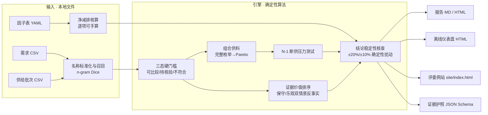

# 供需透镜

[](https://github.com/Aisiweiyang/gongxu-lens-open/actions/workflows/ci.yml) [](#测试与验证) [](#口径边界与免责声明) [MIT](LICENSE)


**面向工业园区与制造企业的再生材料供需匹配和净减排决策系统。**

[English](README.en.md) | 简体中文（默认，源文档）

> **语言政策**：本项目以中文为权威源文档（设计、审计、运维与商业物料均随源更新）；
> 英文版 `README.en.md` 为项目概览与快速上手的对照翻译，两者如有出入以中文为准。

`Python 3.12+ · PyYAML + OR-Tools · 离线计算 · 确定性算法 · MIT`

它把园区内外分散的可利用余料、再生材料供给与企业替代需求连接起来，在规格、数量、时窗、价格和运输约束下，给出可落地的匹配与组合方案，并计算资源循环量、净减排量与绿色成本。核心业务问题：原本会被闲置、低值处置或外运的可利用物料，能否在满足使用要求的前提下，就地就近替代原生材料，并证明净环境收益和经济可行性。

## 30 秒说明

- **客户**：工业园区管委会、园区运营公司或循环化改造服务商；**用户**：产废/供料企业、用料企业采购与工艺人员、园区绿色低碳运营人员。
- **首个场景**：非食品接触类工业包装/周转制品，再生 PP 颗粒替代原生 PP。
- **输入**：一条物料需求 + 若干供给批次（规格/成分/数量/时窗/位置/价格/证据），本地 CSV 导入（模板在 `templates/`）。
- **输出**：报告 + 单文件离线仪表盘——替代性三态筛选、组合供料前沿、逐项可手算的净减排、绿色成本与边际减排成本、一页决策护照。
- **边界**：只描述本次需求与导入供给的匹配结果与情景核算，不构成全市场供需、交易或合规结论；演示数据不得用于真实决策。

## 架构与数据流



数据不出本机：所有输入为本地 CSV/YAML，所有计算为确定性算法（相同输入 → 相同输出，有测试锁定）。

## 快速开始

### 离线演示（报告 + 仪表盘 + 评委网站）

先安装 Python 3.12+ 并克隆仓库。Windows PowerShell：

```powershell
git clone https://github.com/Aisiweiyang/gongxu-lens-open.git
cd gongxu-lens-open
py -3 -m venv .venv
.\.venv\Scripts\python.exe -m pip install -r requirements.txt
.\.venv\Scripts\python.exe run.py --industry 再生PP --data-mode demo
.\.venv\Scripts\python.exe serve.py --port 8765
```

Linux/macOS：

```bash
git clone https://github.com/Aisiweiyang/gongxu-lens-open.git
cd gongxu-lens-open
python3 -m venv .venv
.venv/bin/python -m pip install -r requirements.txt
.venv/bin/python run.py --industry 再生PP --data-mode demo
.venv/bin/python serve.py --port 8765
```

打开 <http://127.0.0.1:8765/>。报告与仪表盘写入 `output/`，演示网站写入 `site/`；
Windows 也可先双击 `安装环境.bat`，再双击 `启动演示网站.bat`。
以下命令中的 `python` 指上述虚拟环境解释器：

```bat
python run.py --industry 再生PP --data-mode demo    :: 报告与仪表盘写入 output/，网站写入 site/
python serve.py --port 8765                          :: 本地预览 http://127.0.0.1:8765/（或双击 启动演示网站.bat）
```

`--list-industries` 可列出已配置行业。

`requirements.txt` 固定 PyYAML 与 OR-Tools 的直接依赖版本。完整安装支持超限场景的
CP-SAT 求解；仅装 PyYAML 时小规模案例仍可运行，但超限时会返回标注“未证实最优”
的贪心可行解。两种配置的结果与性能不能混为一谈。

### 试点工作台（多用户，数据库支撑）

```bat
python pilot\start_pilot.py --port 8765              :: 首次访问初始化管理员账号（无默认密码）
python scripts\pilot_selfcheck.py --port 8765        :: 部署自检（零依赖，只读）
```

角色 admin / editor / viewer；动线覆盖 需求 → 供给批次 → 证据任务 → 方案比较 →
确认预留 → 交付反馈 → 决策护照，另有「多需求撮合」只读试算视图与建议单导出。
Linux 部署（推荐，引擎实测性能约为 Windows 的 2–3 倍；含 systemd 与备份策略）见
`docs/试点部署指南-Linux-v20.md`。

## 数据模式

| 模式 | 行为 |
|---|---|
| `auto` | 默认；本地文件存在时用 local，否则进入 demo |
| `local` | 只读 `data/input/` 下的本地 CSV；缺文件报错（退出码 2，禁止回退演示数据） |
| `demo` | 内置虚构演示数据（1 条需求 × 4 条供给） |
| `online` | 预留，默认关闭（不接入在线数据源，不伪装） |

## 物料供需数据契约

统一单位：质量 `t`、单价 `CNY/t`、总成本 `CNY`、距离 `km`、运输因子 `kgCO2e/(t·km)`、材料/处理因子 `kgCO2e/t`。

### 供给批次 `templates/material_supply.csv`

`seller_name` 之外的必填项：`supply_id`、`supplier_name`、`material_code`、`available_mass_t`。关键可选指标：`polymer_type`、`form`、`color`、`mfi_g_10min`、`moisture_pct`、`ash_pct`、`recycled_content_pct`、`available_from/to`、`price_cny_per_t`、`distance_km`、`transport_mode`、`factor_id`、`evidence_source/date`。指标缺失 → 对应门槛「未知」→ 待核验，不会被淘汰也不默认通过。

### 替代需求 `templates/material_demand.csv`

必填：`demand_id`、`buyer_name`、`target_material_code`、`required_mass_t`。关键可选：`min_recycled_content_pct`、`mfi_min/max`、`max_moisture_pct`、`max_ash_pct`、`accepted_form/color`、`required_from/due_date`、`baseline_virgin_price_cny_per_t`、`max_distance_km`。

### 因子 `config/material_emission_factors.yaml`

每条因子：`factor_id`、`stage`、`material_code`、`value`、`unit`、`boundary`、`region`、`year`、`source_name`、`source_url`、`version`。因子缺失 → 「待补证据」，禁止用 0 代替。演示材料因子为虚构演示假设因子并显著标识。

## 方法说明

1. **替代性硬门槛（三态）**：材料类别、形态、颜色、熔指、水分、灰分、再生含量、数量、时窗、距离逐项判定 通过/不通过/未知。任一不通过 → 不符合；存在未知（含数值无检测报告支撑）→ 待核验；全部通过 → 可比较。缺证据 ≠ 不合规。
2. **净减排核算**（功能单位：交付 1 吨满足需方规格的合格颗粒，供给为已造粒成品，交付质量即分配质量）：

```text
E_baseline = Q × 原生PP生产因子 + Q × 基准运输距离 × 基准运输因子
E_project  = Q × 再生PP颗粒生产因子 + Σ(分配量 × 各候选距离 × 各候选运输因子)
Net_avoided = E_baseline − E_project
```

基准运输距离为配置参数（演示假设），改变它只影响基准侧；距离、因子、价格缺失时标记不可计算/待补证，禁止用 0。每项可展开手算。
3. **组合供料**：把需求质量在可比较供给间按离散步长完整枚举（步长必须整除需求量），产能约束内先得完整可行集，再做非支配筛选，最后按稳定规则截断。组合数超过穷举上限（20,000）时改用 OR-Tools CP-SAT **精确枚举完整三维非支配前沿**（ε-约束直接后继法；三锚点全局精确恒在；前沿点数触达上限 500 时如实截断并标注）。两条路径逐位互验（tests/test_v14_frontier.py），另有独立实现的穷举核验脚本作第三方互验（1 个演示案例 + 6 组随机案例，`docs/独立核验脚本-v10.py`）。
4. **绿色成本**：对每个方案计算 `cost_delta_cny` 与净减排；净减排为正时计算 `marginal_abatement_cost_cny_per_tco2e = cost_delta / (net / 1000)`；分类为成本与碳双降 / 绿色溢价 / 省钱但增排 / 成本与碳双升。该指标只是当前系统边界下的情景值，不是完整生命周期减排成本。Pareto 方向：成本越小越好、净减排越大越好、订单最大份额越小越好；缺价方案不进成本维度 Pareto。因子条目可选携带 `value_min/value_max` 来源极值区间，引擎传播为净减排区间（确定性极值传播，非统计置信区间；demo 因子无区间时输出不变）。
5. **双边撮合（引擎层 v0）**：多需求-共享批次池的稳定匹配建议（Gale-Shapley 容量变体，需求侧按到厂成本/净减排强度、批次侧按演示毛利模型排序），输出带阻断对自检（恒为零）与未满足原因；仅撮合建议，不产生预留或交易（src/matching.py，ADR-0005）。试点工作台勾选多个任务即可计算，支持导出打印友好的 HTML 建议单（服务端同入参即时重算，与页面数值同源，不落库）。大案例（供给 ≥16）的分析与撮合自动转后台作业 + 进度轮询（ADR-0006：作业为进程内存态，重启即失，界面如实告知）。
6. **决策护照**：默认展示 3~5 个代表方案（最低成本 / 最低碳 / 最低集中风险 / 折中 / 基准），下一步建议是「补哪项检测、向谁送样、验证哪种运输方案」，不是立即交易。
7. **结论稳定性核查**：对基准运输距离 ±20%、再生因子 ±10%、运输因子 ±10% 共 6 个确定性扰动场景重算全部方案，如实报告净减排方向翻转数、方案分类变化与入选集合变化；成本排序与 N-1 与因子无关，为确定性结论。若真实数据下结论会翻转，如实报告翻转点，不加工。
8. **AI 口径**：演示路径全部确定性算法；语义分类接口只预留，不声称已接入或训练大模型。

## 当前能力（v13–v27）

以下为 v13–v27 十五轮优化后到达的当前能力（历史迭代见文末 v10/v11 历史口径小节与 `CHANGELOG.md`）：

- **完整组合前沿与三方法互验**（v14）：穷举与 OR-Tools CP-SAT 两条路径逐位互验，另有独立实现核验脚本 1 个演示案例 + 6 组随机案例第三方互验。
- **净减排区间传播**（v14）：因子来源极值（`value_min/value_max`）确定性传播为净减排区间，非统计置信区间；demo 因子无区间时输出不变。
- **多需求撮合与建议单**（v14/v16/v17）：多需求-共享批次池稳定匹配，只读试算不落库（ADR-0005），建议单 HTML 导出。
- **试点工作台**（v10 起，v16–v20 持续强化）：SQLite 单文件、三角色、证据闭环、实时库存与确认预留、审计与备份恢复；配 Linux 部署指南、零依赖自检脚本与安全合规应答清单（v20）。
- **大案例异步运行**（v18）：供给 ≥16 自动转后台作业 + 进度轮询，受理即返（ADR-0006，重启即失如实告知）。
- **界面与容错**（v18）：断网提示、会话过期回登录、防重复提交、删除二次确认，真实 Chrome 容错 E2E 套件把守。
- **场景级并行化**（v19）：敏感性与双情景并发，输出与串行**逐位一致**（改前参考哈希复现 + 串并等价测试 + 独立核验 + 全量锁定四层验证）；30 供给完整分析 430.8s → 179.3s（2.4×）；`SUPPLYLENS_PARALLEL_WORKERS=1` 可强制串行。并行暴露的缓存线程安全缺陷已持锁修复。
- **双语管理**（v21）：中文权威源 + 英文概览 `README.en.md`。
- **呈现与开源基础**（v22–v26）：SVG 标签槽自适应、三端设计令牌化精修与品牌
  favicon、双语 README 与验收徽章、CONTRIBUTING/SECURITY、发行包校验。
  开源准备新增 MIT 许可证、GitHub Actions、静态服务路径边界修复与公开源码导出。

## 实测性能（量级参考，非承诺）

| 项目 | 实测 |
|---|---|
| 并发容量 | ≤20 并发全业务路径零错误；引擎 P95 0.76s（WSL）/ 1.80s（Windows） |
| 大案例（30 供给完整前沿） | 场景级并行化后单次分析 179.3s（串行 430.8s 的 2.4×，输出逐位一致） |
| 大案例端到端（HTTP 全路径单发） | 并行化后实测 549.2s（串行 809.0s 的 1.47×，零错误；约 9–10 分钟） |

方法与原始数据：`docs/压力基准-v16.md`（第五/六节）、`docs/完整分析耗时结构-v18.md`、`benchmarks/`。

## 文档地图

全部文档按「当前口径 / 活文档 / 试点与答辩操作 / 历史归档」四区组织，见 `docs/INDEX.md`；
历史轮次快照在 `docs/archive/`（归档只移动不删除，git 历史可追溯）。
逐轮变更（Added / Changed / Fixed，含验收数字与冻结锚点）与提交信息规范见根目录 `CHANGELOG.md`。

## 基准验证

人工标注演示集（`benchmarks/material_matching_cases_v2.csv`，20 例：开发/保留集分离，
含缩写/同义词/噪声词/跨材料负例/空查询/硬门槛与 v13 门控回归用例），实测（v13）：

| 指标 | 值 |
|---|---|
| 召回 Recall@1（开发集 7 例 / 保留集 6 例） | 0.7 / 0.5（两集 Recall@3 均为 1.0） |
| 硬门槛误放行 / 误杀 | 0 / 0 |
| 候选顺序稳定性 | 稳定 |

召回采用 v13 阈值门控 + 兜底：高相似（≥0.45）或类别联合证据（查询与供给名都含材料
类别词）才召回；有信号未过门控的候选进入兜底层（tier=fallback，展示可见、不进指标）。
样例集为演示标注集（非生产数据），结果不写成生产环境准确率。旧「6 案例 Recall@1=1.0」
为 v10 A03 认定的单候选作弊口径，已废止（见 docs/archive/材料事实修订清单-v10.md）。

## 输出

`run.py` 一次生成四个互不覆盖的输出：Markdown 报告、HTML 报告、离线仪表盘（`output/`）与评委网站 `site/index.html`（十段评委叙事：首屏结论→供需→分阶段匹配→证据价值排序→Pareto→代表组合与 N-1→碳对照与稳定性核查→决策护照→企业检索→市场背景→试点闭环）。

启动本地网站（标准库，无依赖，仅绑定 127.0.0.1）：

```bat
python -B serve.py --port 8765
```

或双击 `启动演示网站.bat`，浏览器访问 http://127.0.0.1:8765/ 。网站单文件离线，无 CDN、无外部请求；支持状态筛选、保守/乐观口径切换、证据动作反事实展示、JSON 证据护照下载、打印样式。

## 指标如何理解

- 净减排是情景核算（原生颗粒生产与运输、再生颗粒生产与运输），不是完整生命周期碳足迹，不宣称认证或用于碳抵消。
- 演示企业、批次、价格、因子全部虚构或演示假设，输出统一标注，不得用于真实决策。
- 材料因子为演示假设因子；运输因子为英国 DEFRA 2024（TTW，非中国口径）。

## 适用与不适用

**适用于**：初步范围界定、热点识别、情景规划、采购组合初筛、园区内部教育演示。

**不适用于**：审计清单、监管报送、碳信用签发、对外披露、合规与合同依据。

本系统输出为估计值而非实测或认证数据；正式使用前须由双方核对检测报告、商务条款与经核实的因子。

## 测试与验证

```bash
python -m pip install -r requirements-test.txt
python scripts/check_project.py   # 全量测试，跳过也视为失败；再执行独立核验
```

独立核验的实际覆盖为 **1 个演示案例 + 6 组固定种子的随机案例**，全部使用独立穷举
与独立核算公式。求解器互验另由测试套件覆盖；这两项覆盖不合并冒称“1 个演示案例 + 6 组随机独立核验”。
CI 在 Linux Python 3.12/3.14 上使用同一入口；浏览器 E2E 按 CONTRIBUTING.md 单独运行。
本轮实际结果与平台限制见 [开源准备验收](docs/开源准备验收-20261008.md)。

覆盖：净减排手算、基准距离回归（只影响基准侧）、门槛三态、组合与缺价、完整前沿
（穷举与 CP-SAT 逐位互验）、净减排区间传播、Pareto 方向（全精度+容差支配）、
N-1（两张分离对照：采购策略 53.3% / 补证后 100%）、敏感性（option_id 键+翻转阈值）、
召回基准（开发/保留集、空查询拒绝、误放行按标签）、导入行级体检、护照 Schema v2、
试点 API（角色/CSRF/幂等/备份恢复往返）、多需求撮合与建议单导出、异步运行路径、
串行/并行输出逐位一致、试点自检脚本。
浏览器级验收四套用真实 Chrome 执行（console 零错误）：冻结锚点四方核对
（e2e_v12）、浏览器全流程（e2e_round2）、撮合页与建议单（e2e_v16）、容错与异步
UI（e2e_v18）；发行包独立验证（scripts/verify_release.py）14 项。
数值冻结锚点由 E2E 数值断言端到端把守：基准 83,025 CNY → 组合 64,182 CNY、
净减排 21,072.98 kgCO2e；组合前沿最低 59,941.25 CNY（tests 锁定）。
测试数以实际运行为准，不在文档中固化承诺。

## v11 关键升级（2026-09-06，最终返修）· 历史口径

> 本节为 v11 当时事实的历史记录，现状能力以「当前能力（v13–v27）」与 `CHANGELOG.md` 为准。

- 证据任务进入决策闭环：结构化证据版本（类型/来源/附件/机构/检测日期/有效期/实测字段/
  提交与审核人/版本号），passed 仅当字段完整且通过业务校验，生成不可静默覆盖的版本并
  写回供应快照、触发重算；驳回保持门槛；历史版本可回放。
- 全局批次库存：可用量 = 原始可供量 − 全部有效预留 − 已确认；预留/确认/释放状态机 +
  原子条件更新防超卖；引擎使用实时可用量；比较与最终确认分离（确认受服务端新鲜度校验）。
- 每请求连接 + 显式事务：CSV 导入整批解析、单事务写入、任意行失败整体回滚；
  失败请求残留绝不泄漏给后续请求。
- 唯一领域校验层（表单/API/CSV 共用）：范围/日期/千分位/NaN/重复 ID 一致处理，结构化 4xx。
- 运行快照冻结完整输入（需求/供给/证据/库存/因子内容/state_hash）；历史护照只从快照
  生成；确认前服务端校验新鲜度。
- 碳基准独立：基准运输方式为需求层显式配置，候选运输方式不再改变基准排放。
- 证据页请求与渲染分离（无无限请求）；工作台支持历史运行恢复、确认采购、
  结构化反馈与真实 KPI（无实证显示「暂无实证」）。

## v10 关键升级（2026-09-05）· 历史口径

> 本节为 v10 当时事实的历史记录，现状能力以「当前能力（v13–v27）」与 `CHANGELOG.md` 为准。

- 方案唯一身份 option_id（同名称不同分配是不同方案）；完整非支配前沿不再被分页截断。
- 碳与成本账本：因子按角色显式解析、边界兼容性按核算约定判定、到厂成本分项
  （材料/运费/装卸/检测/损耗），缺价不按 0；再生质量与交付质量分开。
- N-1 按供应商实体失效 + 两张分离对照（补证影响 vs 采购策略影响）。
- 证据质量八维评分（1 最优）+ 日期标记 + 关键缺证据；单个证据动作只补覆盖字段。
- 护照 Schema v2（身份/哈希/账本 trace/未知项）；导入行级体检拒绝结构错误。
- 试点应用（pilot/）：SQLite + 三角色 + 会话/CSRF + 审计 + 备份恢复，见
  docs/商用试点手册-v10.md。
- 发行双包：dist/competition-demo（静态演示，file:// 离线可开）与 dist/pilot-app
  （独立部署试点），哈希清单见各包 FILES.txt；发行验证记录见 docs/发行验证-v10.md。

## 口径边界与免责声明

- 本系统只描述本次需求与导入供给的匹配结果与情景净减排，不构成交易、合规或投资结论。
- 数据异常仅作为人工核验线索；正式合作前须由双方核对检测报告与商务条款。
- 单供资格 = 一家具备全部产能；部分产能批次只进入组合。
- 演示数据全部虚构并显著标识，不得用于真实决策。
- 本项目为赛事起源的在研项目，目前面向单一组织的局域网试点部署。
- 项目原创代码与文档使用 [MIT 许可证](LICENSE)。第三方依赖与来源资料遵循各自许可，
  详见 [THIRD_PARTY_NOTICES.md](THIRD_PARTY_NOTICES.md)。演示数据与减排结果的使用边界不因开源而改变。
